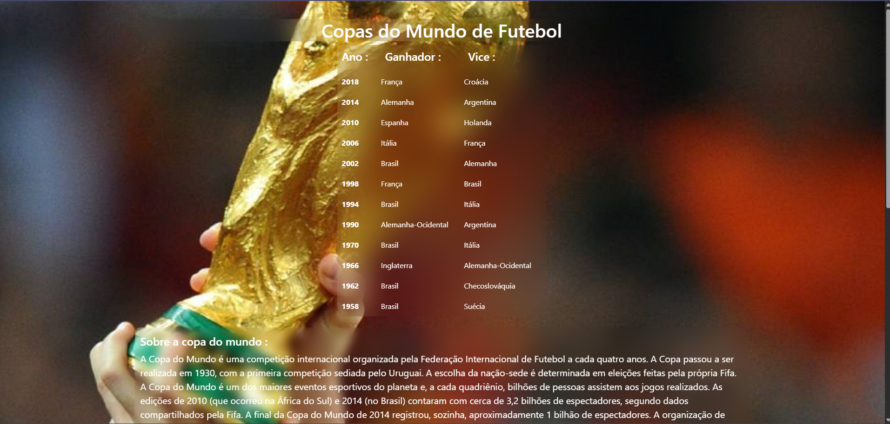

# Futebol
## Atividade do ensino médio técnico
Crie uma página responsiva com o tema que desejar.

--------------------------------------------------

Linguagens: Html, css e Bootstrap.

--------------------------------------------------

## Prints e Gifs
1. Print da tela Inicial

2. Gif da tela completa e responsividade.

